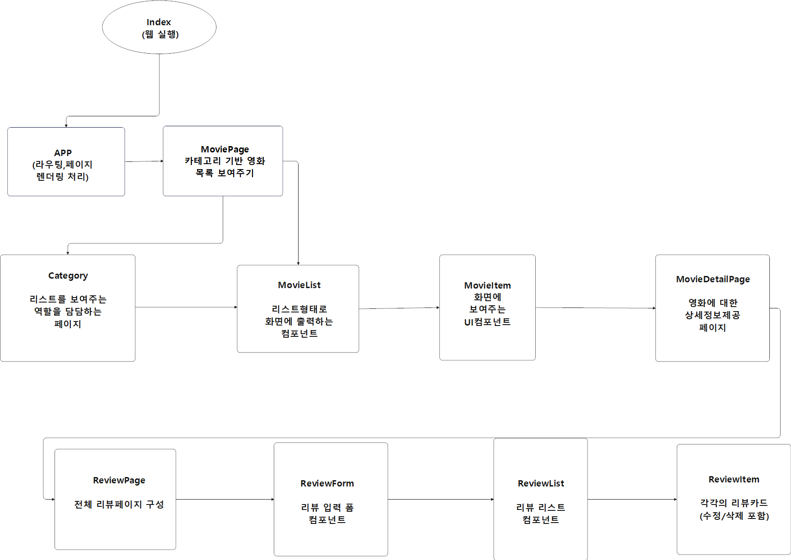
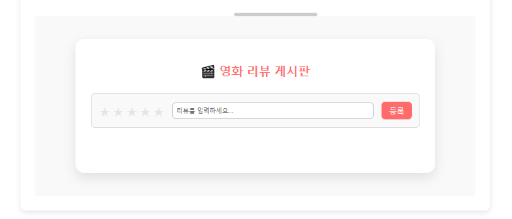
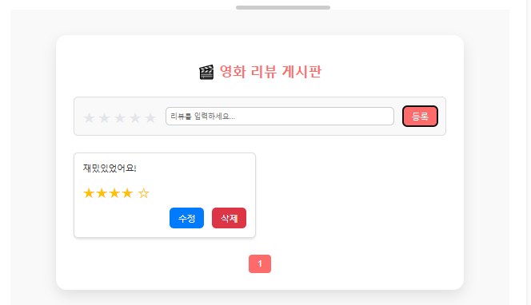

# 🎬 CinemaInfo 프로젝트

TMDB API를 활용한 고성능 SPA 영화 정보 제공 사이트입니다.  
React 기반으로 구현되었으며, 다양한 영화 정보와 사용자 리뷰 기능을 제공합니다.

이 프로젝트는 React 기반 SPA를 통해 외부 API를 활용한 콘텐츠 탐색과,

사용자 입력을 처리하는 CRUD 기능 구현을 목표로 합니다. 성능 최적화와 UI 구성에도 중점을 두었습니다.

---

## 📌 주요 기능

- 🎞 **전체 영화 목록 조회**: 영화 제목, 장르, 배우 등의 정보 제공
- 🔍 **키워드 기반 영화 검색**: 검색어 입력 시 관련 영화 목록 필터링
- ⭐️ **리뷰 게시판**: 리뷰 작성 / 수정 / 삭제 및 별점 부여 기능
- 🔗 **SPA(Single Page Application)**: React Router를 이용한 라우팅 처리

---

## 📊 플로우차트

---

## 🎥 시연 영상

---

## 🖥 구현 화면

### ✅ 메인 페이지

> 장르 및 검색어를 통해 원하는 영화를 선택할 수 있습니다.

---

### ✅ 장르별 영화 선택 및 검색

  

> 선택된 장르 및 키워드에 따라 영화 목록이 동적으로 갱신됩니다.

---

### ✅ 인기 영화 페이지

> TMDB의 인기 영화 리스트를 실시간으로 가져옵니다.

---

### ✅ 영화 상세 정보 페이지

  

> 영화의 상세 정보와 함께 사용자 리뷰를 확인할 수 있습니다.

---

### ✅ 리뷰 작성 및 별점 기능

> 별점 포함 리뷰 작성 / 수정 / 삭제가 가능합니다.

---

## 📄 문서 보기

👉 [PDF로 보기](https://github.com/chanO4135/front_reactProject/blob/main/chan_project.pdf)

---
